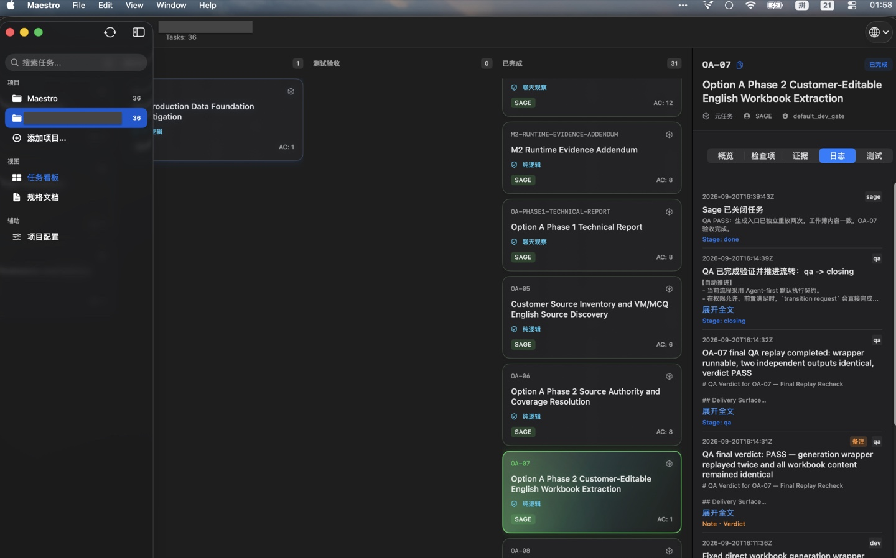
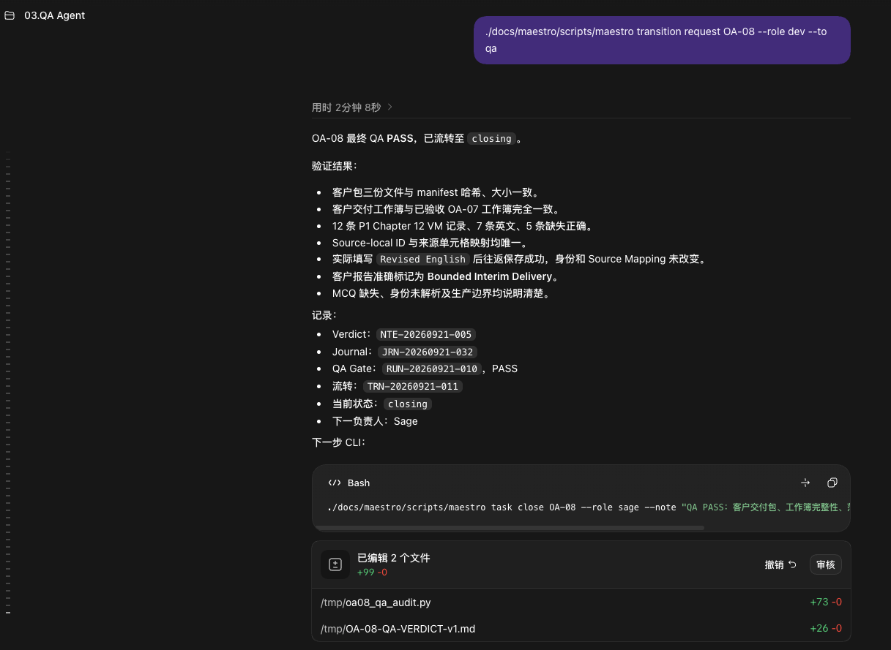
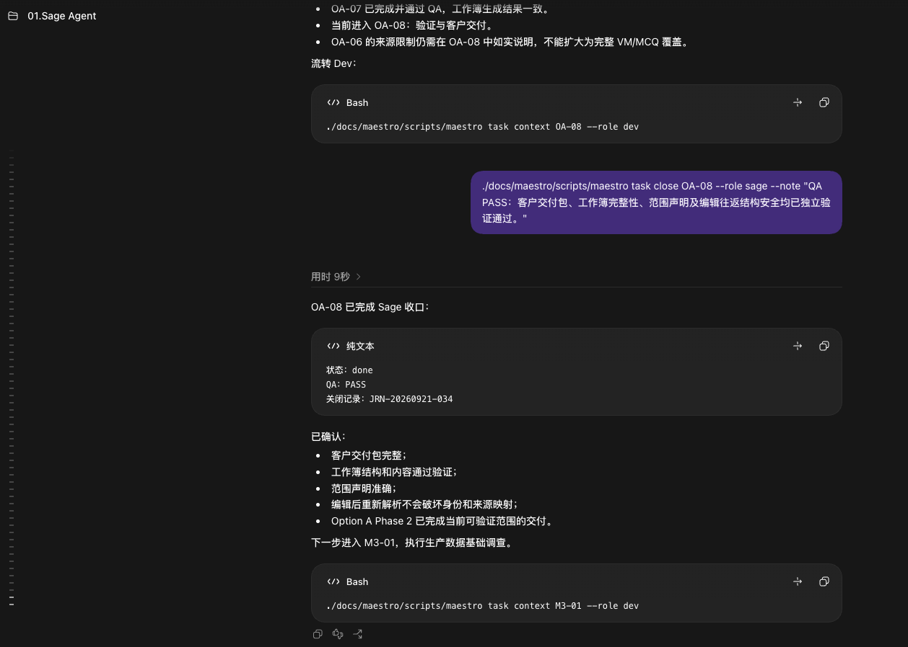
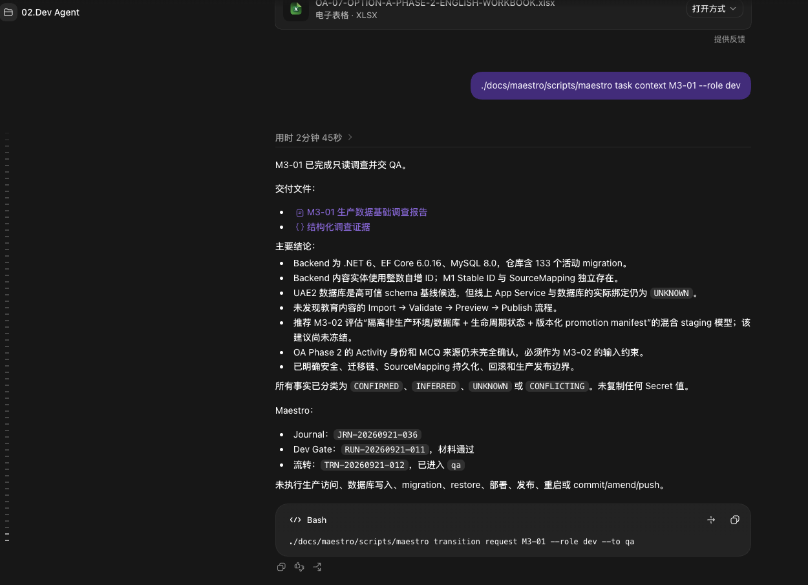
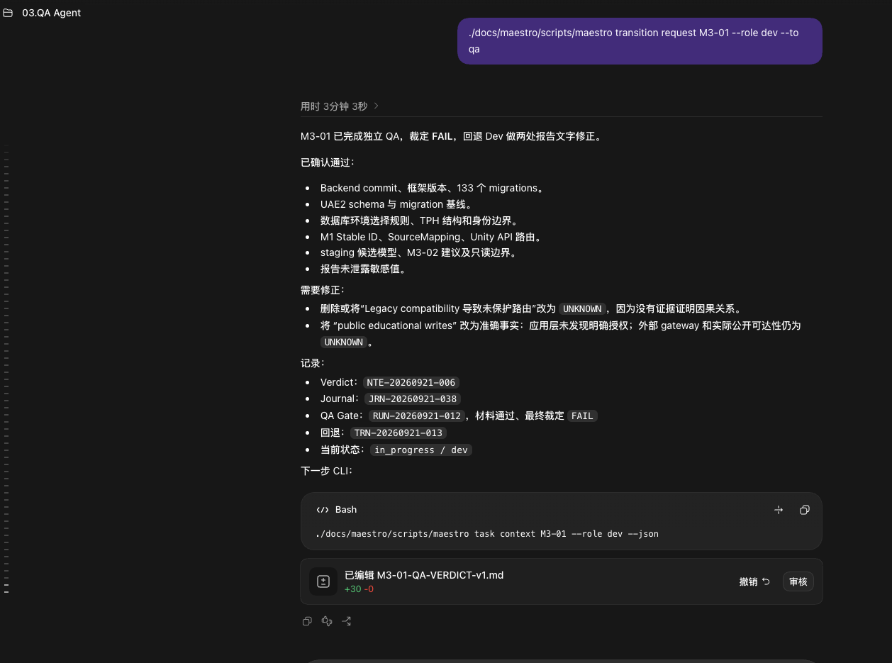
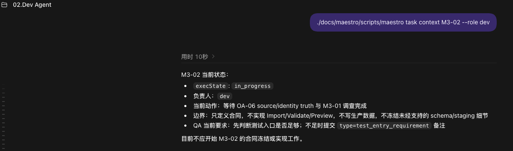

# Maestro 实践案例：真实商业项目中的 Agent 工程工作流

[日本語](README.ja.md) · [English](README.md) · **简体中文**

> **一个不绑定特定 Agent、以持久化项目状态为核心的 Agent-first 软件工程工作流。**

Maestro 是我设计并持续使用的 Agent-first 工作流控制器。

过去一年里，我一直使用它管理真实软件项目中的任务、开发、QA、证据、状态转换和最终关闭。

它并不提供或绑定某一个 AI Agent。

Maestro 将 Agent 视为可以替换的执行者。

只要一个 Agent 能读取项目文件并调用 CLI，它就可以获取当前任务所需要的：

- 任务目标；
- 当前动作；
- 验收标准；
- 修改边界；
- 当前生命周期状态；
- 已有工程产物；
- QA Verdict；
- Gate；
- Journal；
- Evidence；
- 下一步允许的状态转换。

因此，任务不需要依赖某一个聊天会话持续存在。

即使原来的 Agent、模型或会话已经消失，一个新的 Agent 仍然可以基于当前项目 Truth，重新获得完成任务所需要的上下文。

> **Separate conversations. Shared truth.**
>
> **Workers are replaceable. Project truth persists.**

这个案例不属于正式编号章节，也不属于 Research。

它用于提供 Playbook 方法论在真实工程中的运行证据。

---

# 为什么我构建 Maestro

AI Coding Agent 已经可以非常快地实现代码。

但在长期真实项目中，我逐渐发现，真正困难的问题并不只是：

> AI 能不能把代码写出来？

还有另外一组问题：

- 一个新 Agent 怎样知道任务已经做到哪里？
- 谁告诉它哪些内容不能修改？
- 上一个 Agent 做过什么，是否已经验证？
- QA 为什么拒绝了某个结果？
- 一次失败以后应该回到哪个角色？
- 哪些证据仍然有效？
- 当前任务究竟是在开发、QA、等待还是关闭阶段？
- 如果所有上下文都存在聊天历史里，换一个 Agent 后怎么办？
- Human 怎样在不阅读所有 Agent 对话的情况下理解项目当前状态？

如果每次更换会话都需要 Human 重新解释这些内容：

```text
发生过什么
↓
现在在哪里
↓
为什么在这里
↓
下一步要做什么
```

那么 Human 仍然是整个工作流真正的状态存储器。

Maestro 的目标，就是把这部分状态从 Human 和聊天历史中移出来。

---

# Sage：从需求到可执行任务

Maestro 中，Sage 是工作流最上游的协调角色。

Dev 和 QA 接收到的通常已经是一个具有明确目标、边界和验收条件的局部任务。

但现实中的需求一开始往往不是这样。

它可能只是：

- 一段客户描述；
- 一个业务问题；
- 一个需要调查的异常；
- 一个尚未明确边界的功能方向；
- 多个彼此存在依赖的目标。

Sage 负责在执行开始之前，把这些信息整理成 Agent 可以可靠处理的问题世界。

一个典型过程是：

```text
Human / Customer Requirement
↓
Sage 与 Human 讨论并澄清需求
↓
理解业务背景和真实目标
↓
确认当前项目现实与约束
↓
识别依赖、风险和未知项
↓
任务切分
↓
形成 Task Contract / Task Map
↓
发布任务卡
↓
Dev / Design / QA
```

因此，Sage 并不只是「创建任务」。

它需要先理解：

> 为什么要做这件事？

然后才决定：

> 应该把它切成哪些可执行、可验证、边界明确的任务？

较大的现实需求最终可能被拆成：

```text
Requirement
↓
Investigation
↓
Truth / Architecture Confirmation
↓
Implementation Task
↓
Verification
↓
Delivery / Close
```

每张任务卡只携带当前执行真正需要的上下文。

这样 Dev 不需要重新理解整个业务世界，也不需要自行补全产品或 Scope 决策。

QA 同样不需要重新猜测：

> 客户真正想要什么？

它面对的是已经被整理并冻结到当前任务中的：

```text
Task Contract
+
Acceptance Criteria
+
Boundary
+
Artifact
+
Evidence
+
当前现实
```

Sage 因此承担的是：

> **Human Intent 与 Agent Execution 之间的编排层。**

## Sage 不替代 Human

Sage 可以：

- 帮助澄清需求；
- 理解业务上下文；
- 调查当前项目现实；
- 提出任务切分方案；
- 建立任务依赖；
- 生成并发布 Task Contract；
- 管理普通工作流流转；
- 汇总 Dev / QA 的结果；
- 在满足关闭条件以后完成收口。

但 Sage 不因此拥有 Human 的最终业务决策权。

例如：

- 是否改变项目 Scope；
- 是否接受新的客户承诺；
- 是否改变重大业务目标；
- 是否接受高风险例外；
- 是否改变重要项目真相。

这些问题仍然需要 Human 授权。

因此 Maestro 中的基本关系可以理解成：

```text
Human
↓
决定目标 / 价值 / 高影响选择
↓
Sage
↓
理解 / 切分 / 契约化 / 编排
↓
Dev / Design
↓
执行
↓
QA
↓
独立验证
↓
Sage
↓
收口
```

Human 决定：

> 什么值得做。

Sage 负责把这个决定转换成：

> Agent 可以可靠执行和验证的任务结构。

---

# Agent 无关的工作流核心

Maestro 的一个重要设计前提是：

> **工作流不应该绑定某个 Agent。**

它不要求：

- 某一个模型；
- 某一个 AI Provider；
- 某一个聊天产品；
- 某一个 Coding Agent。

真正需要长期存在的是：

```text
Task
+
State
+
Boundary
+
Artifact
+
Evidence
+
Decision
+
Transition
```

Agent 只是当前执行这些任务的 Worker。

例如，一个新的 Dev Agent 可以通过 CLI 读取当前任务：

```bash
maestro task context <task-id> --role dev
```

它获得的不是上一段聊天记录，而是当前任务所需要的结构化执行上下文。

这意味着：

> **上下文恢复并不是重新读取过去所有聊天。**

更准确地说，它是在当前项目现实上：

> **重新构建一个可信的执行起点。**

这使得 Agent 可以被替换，而任务仍然继续。

---

# Human 和 Agent 看见的是同一个项目状态

Agent 通过 CLI 读取执行世界。

Human 通过 Task Board 观察项目世界。

两者依赖同一套持久化 Project Truth。



任务看板并不是用来替代工程状态本身。

它是项目 Truth 面向 Human 的可视化入口。

Human 可以快速看到：

- 当前有哪些任务；
- 每个任务处于哪个阶段；
- 当前负责人是谁；
- 哪些任务正在 QA；
- 哪些已经完成；
- 哪些任务曾经失败或重新进入执行；
- Journal 中发生过哪些状态变化；
- QA Verdict 和 Gate 的结果；
- 下一步由哪个角色负责。

Human 不需要打开每一个 Dev 或 QA 会话重新拼接项目状态。

这使得人的职责从：

```text
记住所有任务发生过什么
```

逐渐变成：

```text
观察系统
+
处理真正需要 Human 判断的事情
```

---

# 真实工程中的三种状态

在下面的真实流程中，Human 没有通过长对话重新向每个 Agent 解释需求。

主要输入只是 Maestro CLI。

任务目标、上下文、边界、已有证据和允许的下一步，由工作流重新投影给当前 Worker。

这里展示三种情况：条件满足时推进，验证失败时返工，条件不足时停止。

正常路径：

```text
Dev
↓
QA
↓
PASS
↓
closing
↓
Sage
```

异常路径：

```text
Sage
↓
Dev
↓
执行到任务边界
↓
QA
↓
FAIL
↓
返回 Dev
```

受控停止：

```text
Dev
↓
读取前置条件
↓
条件不足
↓
不开始
```

下面的截图来自同一个真实商业软件项目。

为保护客户信息，项目标识已经脱敏。

七张截图按照 01 到 07 的顺序编号。

```text
01  正常路径     Human 视角 · Shared Project Truth（已在前一节展示）
02  正常路径     Dev → QA
03  正常路径     QA PASS → closing
04  异常路径     Sage 收口并继续编排
05  异常路径     Dev 只执行到任务边界
06  异常路径     QA FAIL → 返回 Dev
07  受控停止     前置条件不足 · Dev 不开始
```

其中 04 / 05 / 06 是同一个 Task（M3-01）的连续上下文。

07 是同一项目线程里的下一项任务 M3-02，它等待的正是 M3-01 的调查结果。

---

## 02 · 正常执行：Dev → QA


Human 给当前 Worker 的入口只是一个 Maestro Task Context。

Dev 从持久化任务状态中读取目标、范围、验收标准和已有上下文，完成当前职责以后记录：

- 工程产物；
- 验证结果；
- Journal；
- Gate；
- 下一步 Transition。

随后请求：

```text
in_progress
↓
qa
```

Human 不需要重新输入上一阶段的业务背景和完整任务说明。

Dev 也不会因为完成了实现就自行宣布整个 Task 完成。

> **实现完成以后，控制权进入独立 QA。**

---

## 03 · 正常完成：QA PASS → Closing



QA 根据当前 Task Contract、Artifact 和 Evidence 重新执行验证。

满足条件以后：

```text
QA PASS
↓
closing
↓
Sage
↓
done
```

正常任务因此形成完整闭环：

```text
Task Context
↓
Dev
↓
Gate
↓
QA
↓
Verdict
↓
Sage Close
```

Human 不需要在每个角色之间重新组织上下文。

---

## 04 · Sage 收口并继续编排



上一任务通过 QA 后，Sage 完成收口，并立即进入下一项已经规划好的工作。

Human 不需要重新输入上一阶段的业务背景和完整任务说明。

新的入口仍然只是：

```bash
maestro task context M3-01 --role dev
```

Sage 已经把 Human 的目标、项目现实和任务规划转换成 M3-01 的 Task Context。

因此这张截图展示的是：

```text
上一任务关闭
↓
Task State 持续存在
↓
下一位执行者读取当前任务
↓
继续执行
```

这也是 Maestro 支持 Worker 替换的设计方式：

> **Workers are replaceable. Project truth persists.**

不过要注意：**这张截图本身不能证明执行者一定已经换成了另一个 Agent。**

它能证明的是：Human 的显式输入可以只是一条 CLI，而结构化任务上下文由 Maestro 提供。

---

## 05 · Dev 只执行到自己的任务边界



当前 Dev Worker 通过 Maestro Task Context 获得完成 M3-01 所需要的结构化执行上下文，然后直接开始执行。

Human 没有再提供额外业务说明。

当前 Task 已经限定这是一个只读调查，因此 Dev：

- 检查 Backend、数据库结构和 migration；
- 区分 CONFIRMED / INFERRED / UNKNOWN / CONFLICTING；
- 记录调查结论和工程证据；
- 明确没有进行生产访问、数据库写入、migration、restore、部署或发布；
- 在达到当前任务边界以后停止继续扩展。

随后：

```text
Dev Gate = PASS
↓
qa
```

这展示了 Maestro 一个非常重要的目标：

> **Agent 不只需要知道该做什么，也需要知道什么时候已经做到当前边界。**

正常执行并不意味着「尽可能多做」。

它意味着：

> 在授权世界内完成当前任务，然后停止并交接。

---

## 06 · QA FAIL：异常路径返回 Dev



QA 在独立上下文中重新检查 M3-01。

大量调查结果已经得到确认。

但 QA 发现报告中仍然存在两处超出证据范围的确定性表述。

因此最终裁定：

```text
Verdict = FAIL
```

而不是因为「大部分内容正确」就继续放行。

失败同时留下：

- Verdict；
- Journal；
- QA Gate；
- Failure Reason；
- 当前 State；
- 下一 Owner；
- 下一步 CLI。

任务因此回到：

```text
qa
↓
in_progress / dev
```

Human 不需要重新解释：

> QA 为什么失败？

失败本身已经被转换成新的执行上下文。

下一位执行者可以直接从 Maestro 读取：

```bash
maestro task context M3-01 --role dev --json
```

然后处理已经被明确限定的返工内容。

> **异常并不会让工作流失去结构。**
>
> **失败会成为下一轮执行的输入。**

---

## 07 · 前置条件不足：不开始



同一项目线程里的下一项任务 M3-02 被交给 Dev 之后，Dev 读取当前上下文，给出的结论是：

> 目前不应开始 M3-02 的合同冻结或实现工作。

原因是它依赖的前置条件还没有到位：

```text
等待 OA-06 source/identity truth
等待 M3-01 调查完成
```

Dev 没有用推测填补这个空缺，而是把「现在不该开始」本身作为结论记录下来。

同一份 Task Context 里也带着当前边界：

```text
只定义合同
不实现 Import / Validate / Preview
不写生产数据
不冻结未经支持的 schema / staging 细节
```

以及 QA 已经预先登记的要求：

> 先判断测试入口是否足够；不足时提交 `type=test_entry_requirement` 备注。

要注意 `execState` 此时是 `in_progress`，负责人是 `dev`。

也就是说：**任务处于进行中，并不等于它必须往前推进。**

因此：

```text
Dev
↓
读取前置条件
↓
条件不足
↓
不开始
```

> **Worker 拿到任务，不代表它必须开始执行。**
>
> **未解决的不确定性不应该静默传播。**

---

# 为什么这种结构很重要

## 1. Agent 不需要共享聊天历史

Dev 不需要读取 Sage 的完整会话。

QA 也不需要读取 Dev 的全部思考过程。

每个角色只获得：

> 当前职责需要的最小但完整上下文。

不同 Agent 可以拥有：

```text
Separate conversations
```

同时继续依赖：

```text
Shared truth
```

## 2. 新 Agent 可以接手旧任务

长期项目中：

- 会话会结束；
- Agent 会更换；
- 模型会升级；
- Provider 会变化。

如果项目状态只存在于聊天里：

Worker 消失以后，任务上下文也会一起消失。

Maestro 把关键状态保存在工作流本身。

因此一个新的 Agent 可以重新读取：

```text
当前状态
+
当前任务
+
当前边界
+
工程产物
+
仍然有效的证据
+
失败原因
+
允许的下一步
```

然后继续工作。

可以把这个逻辑压缩成：

```text
Task / State / Boundary / Artifact / Evidence
        ↓
存在于 Maestro
        ↓
不依赖某一个聊天会话
        ↓
Worker 可以替换
```

这是工作流的**设计能力**，不是某一张截图单独证明的结论。

目标不是让新的 Worker 拥有旧 Worker 的全部记忆。

目标是：

> **让它拥有完成当前决策所需要的可信世界。**

## 3. QA 拥有独立判断空间

Dev 和 QA 在不同上下文中工作。

QA 不需要继承：

> 「Dev 认为自己已经完成。」

QA 重新面对的是：

```text
Task Contract
+
Acceptance Criteria
+
Artifact
+
Evidence
+
当前现实
```

如果结果不成立：

```text
FAIL
```

就是合法结果。

这减少了同一个 Agent：

```text
自己实现
↓
自己解释
↓
自己证明自己正确
```

所带来的验证偏差。

## 4. 失败不会只剩一句聊天消息

一次 QA FAIL 会留下：

- Verdict；
- Failure Reason；
- Evidence；
- Journal；
- Gate；
- Transition；
- 当前 Owner；
- 当前 State。

因此失败本身也成为工程产物。

下一个 Agent 不需要重新调查：

> 「之前到底为什么失败？」

## 5. Human 不需要成为任务数据库

Maestro 的 Task Board 为 Human 提供整个项目的状态投影。

Human 可以观察：

```text
项目现在在哪里？
↓
什么正在进行？
↓
什么失败？
↓
谁正在负责？
↓
哪些任务已经关闭？
```

而不需要自己保存所有 Agent 会话的上下文。

这使 Human 更适合把注意力放在：

- 目标；
- Scope；
- 重要风险；
- 高影响决策；
- 异常情况；
- 最终责任。

---

# Maestro 的核心机制

Maestro 目前围绕几个核心原则工作。

## Sage Orchestration

Sage 位于 Human Intent 和执行 Worker 之间。

它负责：

- 澄清需求；
- 理解业务与项目现实；
- 识别依赖和未知项；
- 切分任务；
- 生成 Task Contract；
- 发布任务；
- 汇总验证结果；
- 处理普通例外；
- 完成工作流收口。

Sage 的职责不是替 Human 做最终价值判断，而是把 Human 已经授权的目标转换成可执行工作。

可以压缩为：

```text
Human Intent
↓
Sage
↓
Task Map / Task Contract
↓
Workers
```

## Task Contract

任务必须拥有明确的：

```text
summary
currentAction
acceptanceCriteria
boundaries
```

Agent 在一个被定义的问题世界中工作。

## Context Isolation

不同职责拥有不同上下文。

Dev、QA、Sage 不需要共享同一段聊天历史。

## Persistent Project Truth

任务状态不会依赖某一个 Agent 会话。

状态、Journal、Gate、Evidence 和 Transition 可以持续存在。

## Replaceable Workers

Agent 是 Worker。

Worker 可以更换。

项目状态不能因此消失。

## Independent Verification

Dev 负责实现。

QA 负责独立验证。

实现结果不会自动成为 QA Verdict。

## 前置条件检查与安全停止

Worker 在执行前检查当前任务依赖的 Truth、上游状态和任务边界。

如果关键前置条件仍然缺失，正确结果可以是「不开始」，而不是依靠推测继续执行。

这让未知信息停留在工作流中，直到现实条件满足。

## Evidence-driven Transition

状态转换需要理由和证据。

QA Reject 以后，任务携带失败原因重新进入执行阶段。

## Human Observability

Human 可以通过任务看板观察项目状态，而不必阅读全部 Agent 对话。

## Human Authority

AI 可以：

- 实现；
- 调查；
- 验证；
- 生成证据；
- 建议状态转换。

高影响目标、重要 Scope 变化和最终责任仍然属于 Human。

---

# Maestro 与 AI Agent Playbook

Maestro 不是 Playbook 的前提。

Playbook 也不依赖 Maestro。

两者的关系是：

```text
AI Agent Playbook
        ↓
方法论
        ↓
Maestro
        ↓
一种真实的工程实现与验证环境
```

Playbook 讨论：

> 可靠 Agent 工程应该遵循什么原则？

Maestro 用真实项目不断检验：

> 这些原则能不能真正成为一个可以长期运行的系统？

这个案例直接对应 Playbook 中的多个部分：

| Playbook | Maestro 中的实践 |
|---|---|
| 02 · 任务粒度与可执行性 | Task Contract |
| 04 · 上下文隔离策略 | Dev / QA / Sage 独立上下文 |
| 05 · 管理多个 Agent | 角色与责任分离 |
| 06 · 把工作流当作产品来设计 | Workflow、Gate、Transition |
| 08 · 真相治理 | 持久化项目 Truth |
| 11 · 验证与证据 | QA Verdict、Evidence |
| 12 · 决策权 | 角色权限与 Human Authority |
| 14 · 工作流运行时与恢复 | State、Journal、返工与重新进入流程 |

因此，这些截图的价值并不是展示一个 UI。

它们提供的是：

> **方法论在真实工程中的运行证据。**

---

# 这个案例证明了什么

Maestro 仍然是一个持续演化中的个人工程系统。

这个案例并不试图证明：

> 这已经是所有 Agent 项目的最终工作流。

它证明的是更有限、也更具体的事情：

在真实软件开发中，我已经长期使用一套工作流，使：

```text
Agent 可以替换
↓
任务状态持续存在

会话可以结束
↓
工程上下文仍然可以重建

Dev 可以完成当前边界内的工作
↓
QA 仍然拥有独立拒绝权

前置条件不足
↓
Worker 可以停止，而不是自行补全未知信息

任务可以失败
↓
失败原因和证据不会消失

Human 不读取全部聊天
↓
仍然能够理解项目当前状态
```

这也是我构建 Maestro 的核心原因。

> **代码可以由 Agent 快速生成。**
>
> **工程状态不能因此变成黑箱。**

---

# 关于截图

截图来自 Maestro 在真实商业软件开发中的实际使用。

为了保护项目与客户信息：

- 项目标识已经脱敏；
- 不展示客户身份；
- 不展示凭证；
- 不展示受保护业务数据；
- 保留任务生命周期、Agent 输出、QA Verdict、Gate、Journal 与状态转换等工程信息。

截图保留实际工作时的语言。

---

# 核心原则

```text
Human defines intent.
Sage turns intent into executable tasks.
Workers execute in isolated contexts.
QA verifies independently.
Project truth persists across all of them.
```

> Human 定义目标，Sage 将目标转化为可执行任务，Worker 在隔离上下文中执行，QA 独立验证，而项目真相持续存在于所有 Worker 之外。

> **Separate conversations. Shared truth.**

> **Workers are replaceable. Project truth persists.**

> **Agents execute. Gates verify. Human authority remains final.**

---

[← 中文README](../../README.md)
