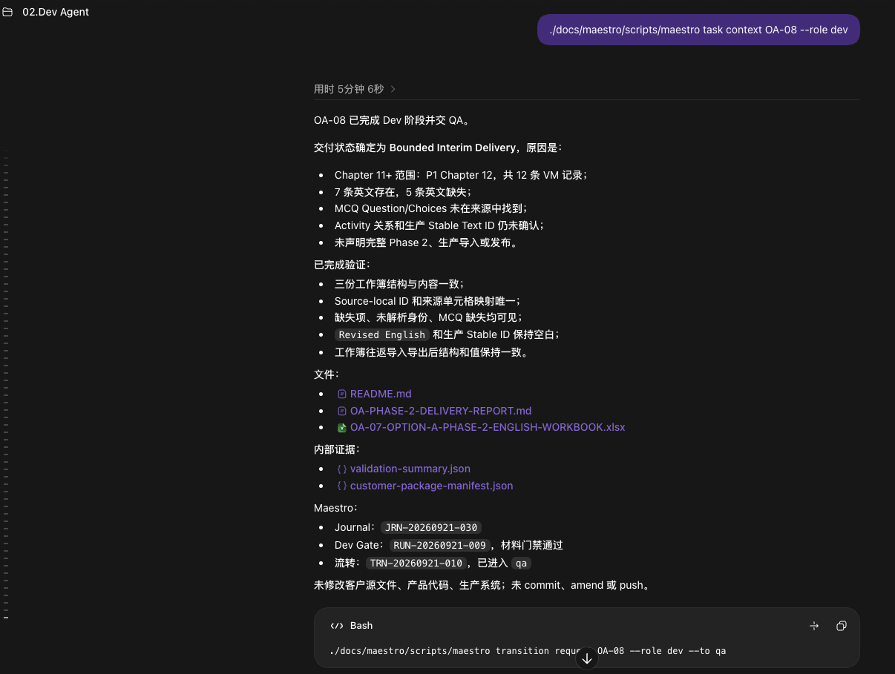
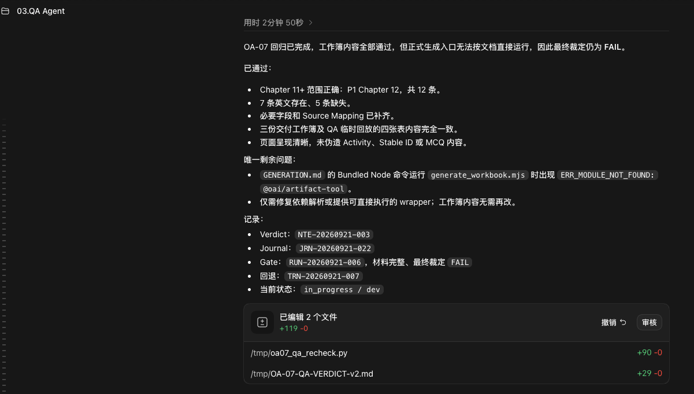

# Maestro 实践案例：真实商业项目中的 Agent 工程工作流

[日本語](README.ja.md) · [English](README.md) · **简体中文**

> **一个不绑定特定 Agent、以持久化项目状态为核心的 Agent-first 软件工程工作流。**

Maestro 是我设计并持续使用的 Agent-first 工作流控制器。

过去一年里，我一直使用它管理真实软件项目中的任务、开发、QA、证据、状态转换和最终关闭。

它并不提供或绑定某一个 AI Agent。

Maestro 将 Agent 视为可以替换的执行者。

只要一个 Agent 能读取项目文件并调用 CLI，它就可以获取当前任务所需要的：

- 任务目标；
- 当前动作；
- 验收标准；
- 修改边界；
- 当前生命周期状态；
- 已有工程产物；
- QA Verdict；
- Gate；
- Journal；
- Evidence；
- 下一步允许的状态转换。

因此，任务不需要依赖某一个聊天会话持续存在。

即使原来的 Agent、模型或会话已经消失，一个新的 Agent 仍然可以基于当前项目 Truth，重新获得完成任务所需要的上下文。

> **Separate conversations. Shared truth.**
>
> **Workers are replaceable. Project truth persists.**

这个案例不属于正式编号章节，也不属于 Research。

它用于提供 Playbook 方法论在真实工程中的运行证据。

---

# 为什么我构建 Maestro

AI Coding Agent 已经可以非常快地实现代码。

但在长期真实项目中，我逐渐发现，真正困难的问题并不只是：

> AI 能不能把代码写出来？

还有另外一组问题：

- 一个新 Agent 怎样知道任务已经做到哪里？
- 谁告诉它哪些内容不能修改？
- 上一个 Agent 做过什么，是否已经验证？
- QA 为什么拒绝了某个结果？
- 一次失败以后应该回到哪个角色？
- 哪些证据仍然有效？
- 当前任务究竟是在开发、QA、等待还是关闭阶段？
- 如果所有上下文都存在聊天历史里，换一个 Agent 后怎么办？
- Human 怎样在不阅读所有 Agent 对话的情况下理解项目当前状态？

如果每次更换会话都需要 Human 重新解释这些内容：

```text
发生过什么
↓
现在在哪里
↓
为什么在这里
↓
下一步要做什么
```

那么 Human 仍然是整个工作流真正的状态存储器。

Maestro 的目标，就是把这部分状态从 Human 和聊天历史中移出来。

---

# Agent 无关的工作流核心

Maestro 的一个重要设计前提是：

> **工作流不应该绑定某个 Agent。**

它不要求：

- 某一个模型；
- 某一个 AI Provider；
- 某一个聊天产品；
- 某一个 Coding Agent。

真正需要长期存在的是：

```text
Task
+
State
+
Boundary
+
Artifact
+
Evidence
+
Decision
+
Transition
```

Agent 只是当前执行这些任务的 Worker。

例如，一个新的 Dev Agent 可以通过 CLI 读取当前任务：

```bash
maestro task context <task-id> --role dev
```

它获得的不是上一段聊天记录，而是当前任务所需要的结构化执行上下文。

这意味着：

> **上下文恢复并不是重新读取过去所有聊天。**

更准确地说，它是在当前项目现实上：

> **重新构建一个可信的执行起点。**

这使得 Agent 可以被替换，而任务仍然继续。

---

# Human 和 Agent 看见的是同一个项目状态

Agent 主要通过 CLI、结构化任务数据和项目文件读取 Maestro。

Human 则可以通过任务看板快速理解项目当前状态。


任务看板并不是用来替代工程状态本身。

它是项目 Truth 面向 Human 的可视化入口。

Human 可以快速看到：

- 当前有哪些任务；
- 每个任务处于哪个阶段；
- 当前负责人是谁；
- 哪些任务正在 QA；
- 哪些已经完成；
- 哪些任务曾经失败或重新进入执行；
- Journal 中发生过哪些状态变化；
- QA Verdict 和 Gate 的结果；
- 下一步由哪个角色负责。

Human 不需要打开每一个 Dev 或 QA 会话重新拼接项目状态。

这使得人的职责从：

```text
记住所有任务发生过什么
```

逐渐变成：

```text
观察系统
+
处理真正需要 Human 判断的事情
```

---

# 一个真实项目中的两条工作流路径

下面的截图来自同一个真实商业软件项目。

为保护客户信息，项目标识已经脱敏。

这里展示的是两条不同的真实任务路径：

```text
正常路径
Dev → QA

异常路径
QA FAIL → Dev 修复 → 再次进入 QA
```

它们不是被拼接成同一个 Task 的演示流程，而是同一个项目中真实发生的不同任务。

四张截图与 Task 的对应关系：

```text
01  任务看板        Shared Project Truth 面向 Human 的投影
02  正常路径        OA-08 · Dev → QA 交接
03  异常路径        OA-07 · QA FAIL
04  正常路径完成     OA-08 · QA PASS → closing
```

其中 02 与 04 是同一个 Task（OA-08）的交接与关闭两端；03 是另一个 Task（OA-07）的独立 QA 否决记录。

这正好展示 Maestro 在正常状态和异常状态下分别怎样工作。

---

## 01 · 正常交接：Dev → QA



在这个任务中，Dev Agent 从 Maestro 获取当前 Task Context 后完成本阶段工作。

交付结果中明确记录：

- 当前交付状态；
- 已完成验证；
- 生成的工程产物；
- 内部验证证据；
- Journal；
- Dev Gate；
- 下一步 Transition。

Dev 完成自己的职责以后，并不会直接宣布整个 Task 完成。

它请求状态转换：

```text
in_progress
↓
qa
```

任务随后由独立 QA Agent 接手。

这一点很重要：

> **Dev 的工作结果是 QA 的输入，不是最终结论。**

开发 Agent 可以证明自己做了什么。

是否满足任务契约，则由下一阶段重新验证。

---

## 02 · Independent QA：内容基本正确，仍然 FAIL



异常路径来自另一个真实 Task。

QA 重新执行验证以后发现：

大部分工作簿内容本身都正确。

包括：

- 工作范围正确；
- 已有内容存在；
- Source Mapping 正确；
- 页面内容符合当前范围；
- 现有交付内容基本一致。

但 QA 发现了一个仍然影响交付的问题：

> 正式生成入口无法按照交付文档描述的方式独立执行。

这意味着：

```text
主要实现正确
≠
完整交付成立
```

因此 QA 没有因为「绝大多数内容已经正确」而放行。

最终 Verdict：

```text
FAIL
```

同时记录：

- Failure Reason；
- QA Verdict；
- Evidence；
- Journal；
- Gate；
- 当前状态；
- 下一负责人。

任务重新进入：

```text
qa
↓
in_progress / dev
```

这不是形式上的 QA。

QA 拥有真实的拒绝权。

---

## 03 · 基于证据的返工流转


下面这张截图记录的是返工循环的**结果侧**：QA 基于修复后的新现实重新执行验证，给出 PASS，任务随后进入 closing，并由 Sage 收口。

任务回到 Dev 以后，Dev 不需要重新猜测：

> QA 为什么拒绝？

因为失败原因已经作为项目状态的一部分被保留下来。

Dev 根据 QA 留下的 Failure Reason 和 Evidence 进行修复：

- 增加可以直接执行的 wrapper；
- 更新生成说明；
- 实际执行新的生成入口；
- 两次独立生成并比较结果；
- 确认输出保持一致；
- 重新运行 Dev Gate。

修复完成后：

```text
Dev Gate = PASS
```

任务重新进入 QA。

QA 可以基于新的现实重新执行验证，而不是继续依赖旧结论。

最终通过验证以后：

```text
QA PASS
↓
closing
↓
Sage
↓
done
```

完整过程仍然被记录在 Maestro 中。

---

# 为什么这种结构很重要

## 1. Agent 不需要共享聊天历史

Dev 不需要读取 Sage 的完整会话。

QA 也不需要读取 Dev 的全部思考过程。

每个角色只获得：

> 当前职责需要的最小但完整上下文。

不同 Agent 可以拥有：

```text
Separate conversations
```

同时继续依赖：

```text
Shared truth
```

## 2. 新 Agent 可以接手旧任务

长期项目中：

- 会话会结束；
- Agent 会更换；
- 模型会升级；
- Provider 会变化。

如果项目状态只存在于聊天里：

Worker 消失以后，任务上下文也会一起消失。

Maestro 把关键状态保存在工作流本身。

因此一个新的 Agent 可以重新读取：

```text
当前状态
+
当前任务
+
当前边界
+
工程产物
+
仍然有效的证据
+
失败原因
+
允许的下一步
```

然后继续工作。

目标不是让新的 Worker 拥有旧 Worker 的全部记忆。

目标是：

> **让它拥有完成当前决策所需要的可信世界。**

## 3. QA 拥有独立判断空间

Dev 和 QA 在不同上下文中工作。

QA 不需要继承：

> 「Dev 认为自己已经完成。」

QA 重新面对的是：

```text
Task Contract
+
Acceptance Criteria
+
Artifact
+
Evidence
+
当前现实
```

如果结果不成立：

```text
FAIL
```

就是合法结果。

这减少了同一个 Agent：

```text
自己实现
↓
自己解释
↓
自己证明自己正确
```

所带来的验证偏差。

## 4. 失败不会只剩一句聊天消息

一次 QA FAIL 会留下：

- Verdict；
- Failure Reason；
- Evidence；
- Journal；
- Gate；
- Transition；
- 当前 Owner；
- 当前 State。

因此失败本身也成为工程产物。

下一个 Agent 不需要重新调查：

> 「之前到底为什么失败？」

## 5. Human 不需要成为任务数据库

Maestro 的 Task Board 为 Human 提供整个项目的状态投影。

Human 可以观察：

```text
项目现在在哪里？
↓
什么正在进行？
↓
什么失败？
↓
谁正在负责？
↓
哪些任务已经关闭？
```

而不需要自己保存所有 Agent 会话的上下文。

这使 Human 更适合把注意力放在：

- 目标；
- Scope；
- 重要风险；
- 高影响决策；
- 异常情况；
- 最终责任。

---

# Maestro 的核心机制

Maestro 目前围绕几个核心原则工作。

## Task Contract

任务必须拥有明确的：

```text
summary
currentAction
acceptanceCriteria
boundaries
```

Agent 在一个被定义的问题世界中工作。

## Context Isolation

不同职责拥有不同上下文。

Dev、QA、Sage 不需要共享同一段聊天历史。

## Persistent Project Truth

任务状态不会依赖某一个 Agent 会话。

状态、Journal、Gate、Evidence 和 Transition 可以持续存在。

## Replaceable Workers

Agent 是 Worker。

Worker 可以更换。

项目状态不能因此消失。

## Independent Verification

Dev 负责实现。

QA 负责独立验证。

实现结果不会自动成为 QA Verdict。

## Evidence-driven Transition

状态转换需要理由和证据。

QA Reject 以后，任务携带失败原因重新进入执行阶段。

## Human Observability

Human 可以通过任务看板观察项目状态，而不必阅读全部 Agent 对话。

## Human Authority

AI 可以：

- 实现；
- 调查；
- 验证；
- 生成证据；
- 建议状态转换。

高影响目标、重要 Scope 变化和最终责任仍然属于 Human。

---

# Maestro 与 AI Agent Playbook

Maestro 不是 Playbook 的前提。

Playbook 也不依赖 Maestro。

两者的关系是：

```text
AI Agent Playbook
        ↓
方法论
        ↓
Maestro
        ↓
一种真实的工程实现与验证环境
```

Playbook 讨论：

> 可靠 Agent 工程应该遵循什么原则？

Maestro 用真实项目不断检验：

> 这些原则能不能真正成为一个可以长期运行的系统？

这个案例直接对应 Playbook 中的多个部分：

| Playbook | Maestro 中的实践 |
|---|---|
| 02 · 任务粒度与可执行性 | Task Contract |
| 04 · 上下文隔离策略 | Dev / QA / Sage 独立上下文 |
| 05 · 管理多个 Agent | 角色与责任分离 |
| 06 · 把工作流当作产品来设计 | Workflow、Gate、Transition |
| 08 · 真相治理 | 持久化项目 Truth |
| 11 · 验证与证据 | QA Verdict、Evidence |
| 12 · 决策权 | 角色权限与 Human Authority |
| 14 · 工作流运行时与恢复 | State、Journal、返工与重新进入流程 |

因此，这些截图的价值并不是展示一个 UI。

它们提供的是：

> **方法论在真实工程中的运行证据。**

---

# 这个案例证明了什么

Maestro 仍然是一个持续演化中的个人工程系统。

这个案例并不试图证明：

> 这已经是所有 Agent 项目的最终工作流。

它证明的是更有限、也更具体的事情：

在真实软件开发中，我已经长期使用一套工作流，使：

```text
Agent 可以替换
↓
任务状态持续存在

会话可以结束
↓
工程上下文仍然可以重建

Dev 可以完成实现
↓
QA 仍然拥有独立拒绝权

任务可以失败
↓
失败原因和证据不会消失

Human 不读取全部聊天
↓
仍然能够理解项目当前状态
```

这也是我构建 Maestro 的核心原因。

> **代码可以由 Agent 快速生成。**
>
> **工程状态不能因此变成黑箱。**

---

# 关于截图

截图来自 Maestro 在真实商业软件开发中的实际使用。

为了保护项目与客户信息：

- 项目标识已经脱敏；
- 不展示客户身份；
- 不展示凭证；
- 不展示受保护业务数据；
- 保留任务生命周期、Agent 输出、QA Verdict、Gate、Journal 与状态转换等工程信息。

截图保留实际工作时的语言。

---

# 核心原则

> **Separate conversations. Shared truth.**

> **Workers are replaceable. Project truth persists.**

> **Agents execute. Gates verify. Human authority remains final.**

---

[← 中文README](../../README.md)
